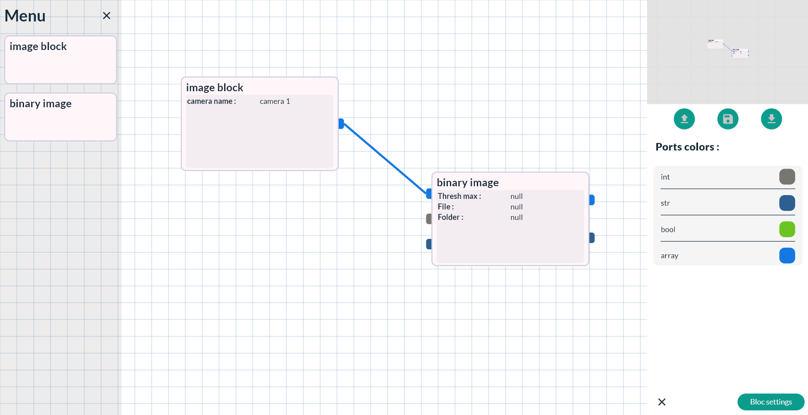

# Node program Editor

Node program editor is a Flutter package based on the flutter package diagram_editor.

## Disclamer

This project is curently made for a school project some functions can be partialy build, unstable or just not generic.

If you had any advice or any trouble to notify, feel free to contact me !

## Description

The package provide a NodeProgramEditor widget witch is an editor dashboard who look like this :

## Last features

Since version 1.0.0, we start replacing all json use for dart class to add more flexiblity. 

## RoadMap

- Create blocks parameters object to fit more with parameters field
- Create design object to offer more design option to the blocks
- Improve link UX with drag link
- Improve link style options
