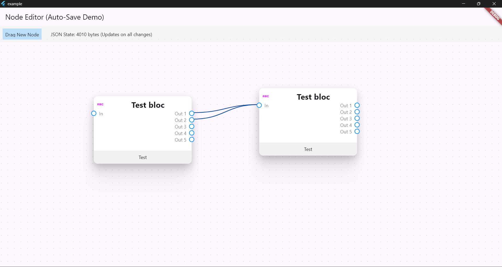

# Node program Editor

Node program editor is a Flutter package based on the flutter package diagram_editor.


## Disclamer

This project is curently made for a school project some functions can be partialy build, unstable or just not generic.

If you had any advice or any trouble to notify, feel free to contact me !



## Import 

```
 flutter pub add node_program_editor
```

## Usage 

The package provide 3 widgets to use :

### EditorCanvas

EditorCanvas is the main widget of the package. It display the grid and the nodes. 
The widget is a flutter DragTarget waiting for NodeData object.

You also have two call back : 
onSaveRequest
onLoadRequest

Who respectively convert your diagram to json and create a diagram from your json.

### NodeData

NodeData handle all the the settings for the node :
- Input and output port data
- Icon
- Icon color
- Ports color
- Selected color
- Type name
- Name

### Port

Port handle information for link connection. You can set for port a maximum of connections

## RoadMap

- Add Port type
- Add Port type colors
- Handle update on nodes

